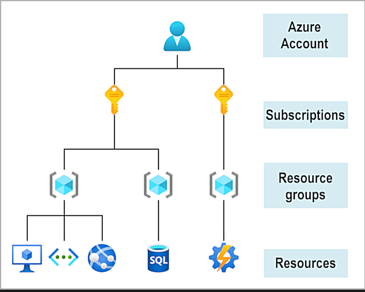

# 02 - Describe Azure architecture and services

## 1. Describe the core architectural components of Azure

- To create and use Azure services, you need an **Azure Subscription**.
- You can create multiple subscriptions under one account.
- Each subscription may have multiple resource groups and each resource group may have multiple servce running under it.



The Azure free account includes:

- Free access to popular Azure products for 12 months.
- A credit to use for the first 30 days.
- Access to more than 25 products that are always free.

Once you have an account, you can create additional subscriptions. you can organize them into invoice sections. You can use billing profiles to setup invoices.

The Azure free student account offer includes:

- Free access to certain Azure services for 12 months.
- A credit to use in the first 12 months.
- Free access to certain software developer tools.

### Some commands

Get date in powershell

```powershell
Get-date
```

Get date in bash

```bash
date
```

Most azure specific commands start with `az`. The following is a command to check the version of azure CLI that you are using.

```bash
az version
```

```json
{
  "azure-cli": "2.64.0",
  "azure-cli-core": "2.64.0",
  "azure-cli-telemetry": "1.1.0",
  "extensions": {
    "ai-examples": "0.2.5",
    "ml": "2.29.0",
    "ssh": "2.0.5"
  }
}
```

Update the azure CLI.

```bash
az upgrade
```

For ease of use, you can also setup the azure interactive CLI where it starts to resemble an IDE.

```bash
az interactive
```

In interactive mode you do not need to prefix the command with `az`. you can just type in the command itself. For example, instead of typing in `az version`, you can just use the `version` command now.

You can also exit the interactve mode by using the `exit` command.

### Describe Azure Physical infrastructure

Azure datacenters are grouped into **Azure Regions** or **Azure Availability Zones**. Check out the [website](https://datacenters.microsoft.com) to learn more.

#### Regions

- A geographical area on the planet that contains at least one, but potentially multiple datacnters that are nearby and networked together with a low-latency network.
- Azure is smart enough to manage the load within each region.

#### Availability Zones

- They are physically separate datacenters within an Azure region. Each availability zone is made up of one or more datacenters equipped with independent resources.
- If one goes down, the other still works.
- They are connected using high-speed, private fibre optic cables.
- To ensure resiliency, a minimum of three separate availability zones are present in all availability zone-enabled regions. However, not all Azure Regions currently support availability zones.
- Azure allows you the option to deploy your app and configure it to use availability zones.

Availability zones are primarily for VMs, managed disks, load balancers, and SQL databases. Azure services that support availability zones fall into three categories:

- **Zonal services:** You pin the resource to a specific zone (for example, VMs, managed disks, IP addresses).
- **Zone-redundant services:** The platform replicates automatically across zones (for example, zone-redundant storage, SQL Database).
- **Non-regional services:** Services are always available from Azure geographies and are resilient to zone-wide outages as well as region-wide outages.

#### Region pairs

Availability zones are only limited to a specific region but if a major outage occurs, region pairs can prove to be very helpful.

- Same geography but different regions.
- At least 300 miles away from each other.
- If a region fails as a whole, services would automatically fail-over to the other region in the region pair.
- Not all Azure services do this automatically so this needs to be configured by the user.
- Eg. West US is paired with East US.
- There is a priority order for regions. So lets say that two regions go down at once, one of them will be prioritized.
- Updates are rolled out to one region at a time to minimize risk and downtime.
- Same geography as pair except for Brazil South due to some law enforcement reasons.
- Most regions are paired in both directions. This means that they are a backup for each other but Brazil South and India West are paired only in one direction. So, even though West India’s secondary region is South India, South India does not rely on West India. West India's secondary region is South India, but South India's secondary region is Central India. Brazil South is unique because it's paired with a region outside of its geography. Brazil South's secondary region is South Central US. The secondary region of South Central US isn't Brazil South.

### Sovereign Regions

Sovereign regions are instances of Azure that are isolated from the main instance of Azure. You may need to use a sovereign region for compliance or legal purposes.

Azure sovereign regions include:

- **US DoD Central, US Gov Virginia, US Gov Iowa and more:** These regions are physical and logical network-isolated instances of Azure for U.S. government agencies and partners. These datacenters are operated by screened U.S. personnel and include additional compliance certifications.
- **China East, China North, and more:** These regions are available through a unique partnership between Microsoft and 21Vianet, whereby Microsoft doesn't directly maintain the datacenters.

### Describe Azure Infrastructure Management

#### Azure resources and resource groups

- A **resource** is the basic building block of Azure,
- **Resource Groups** are groupings of resources.
- Each resource should be in a resource group.
- Each resource cannot be in more than one resource group at a time.
- Resource groups cannot be nested.
- If you apply an action to a resource group, that actions propagates on to the resources in the group as well.

#### Azure Subscriptions

- Allow you to logically organize your resource groups and facilitate billing.
- They cannot be nested.
- You need a subscription to use Azure.
- Each subscription links to an Azure account.
- Each account is required to have only one subscription but can have multiple of them.
- **Billing boundary:** This subscription type determines how an Azure account is billed for using Azure. You can create multiple subscriptions for different types of billing requirements. Azure generates separate billing reports and invoices for each subscription so that you can organize and manage costs.
- **Access control boundary:** Azure applies access-management policies at the subscription level, and you can create separate subscriptions to reflect different organizational structures. An example is that within a business, you have different departments to which you apply distinct Azure subscription policies. This billing model allows you to manage and control access to the resources that users provision with specific subscriptions.

#### Azure Management Groups

- You organize subscriptions into containers called management groups and apply governance conditions to the management groups.
- All subscriptions within a management group automatically inherit the conditions applied to the management group.
- Unlike resource groups and subscriptions, Azure Management groups can be nested.


- 10,000 management groups can be supported in a single directory.This means that within a single Azure Active Directory tenant, you can have up to 10,000 management groups to organize and manage your subscriptions.
- A management group tree can support up to six levels of depth. This limit doesn't include the root level or the subscription level.
- Each management group and subscription can support only one parent.

## 02. Describe Azure Compute and Networking Services

### Azure Virtual Machines

Azure VMs allows you to create VMs in the cloud.

#### VM scale sets

- Lets you create a group of identical, load-balanced VMs.
- Scale sets allow you to centrally manage, configure, and update a large number of VMs in minutes.
- The number of VM instances can automatically increase or decrease in response to demand, or you can set it to scale based on a defined schedule.
- Virtual machine scale sets also automatically deploy a load balancer to make sure that your resources are being used efficiently.

#### VM Availabilty Sets

Increase VM resilience and high availability by ensuring VMs stagger updates and have varied power and network connectivity.

**Two Groupings**:

1. **Update Domain**:

   - Groups VMs that can be rebooted together.
   - Only one update domain is updated at a time.
   - Each group has a 30-minute recovery time before the next update domain is updated.

2. **Fault Domain**:
   - Groups VMs by shared power source and network switch.
   - VMs are spread across up to three fault domains, reducing risk from power or networking failures.

No additional cost for availability sets; you only pay for the VMs.

- Moving from physical servers to VMs on the cloud is also known as _lift and shift_.

##### Creating a VM using Azure CLI

```bash
az vm create \
  --resource-group "[resource group name]" \
  --name my-vm \
  --public-ip-sku Standard \
  --image Ubuntu2204 \
  --admin-username azureuser \
  --generate-ssh-keys
```

##### Configure `nginx` on VM

```bash
az vm extension set \
  --resource-group "[resource group name]" \
  --vm-name my-vm \
  --name customScript \
  --publisher Microsoft.Azure.Extensions \
  --version 2.1 \
  --settings '{"fileUris":["https://raw.githubusercontent.com/MicrosoftDocs/mslearn-welcome-to-azure/master/configure-nginx.sh"]}' \
  --protected-settings '{"commandToExecute": "./configure-nginx.sh"}'
```

### Azure Virtual Desktops

#### Azure Virtual Desktop (AVD) Overview

- Desktop and application virtualization service that runs in the cloud.
- Use a cloud-hosted version of Windows from any location, across devices, OS, or browsers.
- Centralized security management via Microsoft Entra ID (This is microsoft's identity management system).
- Supports multifactor authentication (MFA) and role-based access control (RBAC).
- Desktops and apps run in the cloud, reducing the risk of data exposure on local devices.
- User sessions are isolated in both single and multi-session environments.
- Supports Windows 10/11 Enterprise multi-session, allowing multiple concurrent users on one VM.
- Provides better app compatibility and user experience compared to Windows Server OS.

#### Software on Azure Virtual Desktop

Software like **SharePoint** and other Microsoft 365 apps can run on Azure Virtual Desktop. AVD supports various enterprise applications, including those in the Microsoft 365 suite (SharePoint, Teams, Word, Excel, etc.), enhancing collaboration and productivity in a virtual desktop environment.

### Azure containers

Vms virtualize the hardware while container virtualize the operating system. Containers are more efficient that VMs.

- Containers can be orchestrated using container cluster orchestration.
- If you need complete control of the environment, you might choose a VM.

#### Azure container instances

- PaaS offering.
- Upload containers and the the services runs them for you.

#### Azure container apps

- PaaS offering.
- Similar to container instances with the added benefits such as load balancing and scaling.

#### Azure Kubernetes Services (AKS)

- Container Orchestration service.
- Control lifecycle of conatiners and make fleet management more simpler and efficient.

#### Addional Points

- Containers are usually used with a microservice architecture.
- Scale different parts separately.
- Change one part without impacting the others.

### Azure Functions

- Serverless compute.
- An event wakes up a function. There is no need to run the resource continuously when there are no events.
- No responsibility to manage servers. Its abstracted.
- Don't have to focus on administrative tasks. It is very scalable as well.
- Only pay for what you use as this is event driven.
- Azure Functions runs your code when it triggers and automatically deallocates resources when the function is finished. In this model, Azure only charges you for the CPU time used while your function runs.
- Functions can be either stateless or stateful. When they're stateless (the default), they behave as if they restart every time they respond to an event. When they're stateful (called Durable Functions), a context is passed through the function to track prior activity.

### Application Hosting Options using Azure App Service

- App Service enables you to build and host web apps, background jobs, mobile back-ends, and RESTful APIs in the programming language of your choice without managing infrastructure.
- It offers automatic scaling and high availability.
- App Service supports Windows and Linux.
- It enables automated deployments from GitHub, Azure DevOps, or any Git repo to support a continuous deployment model.

### Azure Virtual Networking

Connect Azure resources like VMs, web apps, and databases to each other, the internet, and on-premises networks.

- **Public Endpoints**: Accessible globally with a public IP.
- **Private Endpoints**: Use private IPs within the virtual network for internal communication.

1. **Isolation & Segmentation**:

   - Create isolated virtual networks with private IP ranges.
   - Divide IP space into subnets for segmentation.
   - Can either use Azure name resolution service or an external DNS server.

2. **Internet Communications**:

   - Public IPs for external access.
   - Resources behind public load balancers for incoming connections.

3. **Communication Between Azure Resources**:

   - VMs, App Service, Kubernetes, and more connect within a virtual network.
   - Service endpoints improve security for resources like Azure SQL and Storage.

4. **Communicate with On-Premises Resources**:

   - **Point-to-site** virtual private network connections are from a computer outside your organization back into your corporate network. In this case, the client computer initiates an encrypted VPN connection to connect to the Azure virtual network.
   - **Site-to-site** virtual private networks link your on-premises VPN device or gateway to the Azure VPN gateway in a virtual network. In effect, the devices in Azure can appear as being on the local network. The connection is encrypted and works over the internet.
   - **Azure ExpressRoute** provides a dedicated private connectivity to Azure that doesn't travel over the internet. ExpressRoute is useful for environments where you need greater bandwidth and even higher levels of security.

5. **Route Network Traffic**:

   - Default routing between subnets, on-premises, and the internet.
   - **Custom Route Tables**: Control traffic flow.
   - **Border Gateway Protocol (BGP)**: Propagate on-premises routes to Azure.

6. **Filter Network Traffic**:

   - **Network Security Groups (NSGs)**: Define rules to allow/block traffic.
   - **Network Virtual Appliances**: Specialized VMs for security functions (e.g., firewalls).

7. **Connect Virtual Networks**:
   - **Virtual Network Peering**: Private connection between virtual networks, even across regions. Never enters the internet. Travels on the microsoft backbone network.
   - **User-Defined Routes (UDR)**: Control traffic routing between subnets and VNets.

#### Configure Network Access

##### Show list of all running VMs

```bash
az vm list
```

##### Get your VM's ip address and store it in a variable

```bash
IPADDRESS="$(az vm list-ip-addresses \
  --resource-group "learn-9b90047b-2597-4d55-95ac-989821a9179a" \
  --name my-vm \
  --query "[].virtualMachine.network.publicIpAddresses[*].ipAddress" \
  --output tsv)"
```

##### Access your web server

```bash
curl --connect-timeout 5 http://$IPADDRESS
```

This won't run as we have not setup any rules yet.

##### List NSGs associated with your VM

```bash
az network nsg list --resource-group "learn-9b90047b-2597-4d55-95ac-989821a9179a" --query '[].name' --output tsv
```

##### List rules associated with your NSG `my-vmNSG`

```bash
az network nsg rule list --resource-group "learn-9b90047b-2597-4d55-95ac-989821a9179a" --nsg-name my-vmNSG

# RUN WITH QUERY

az network nsg rule list --resource-group "learn-9b90047b-2597-4d55-95ac-989821a9179a" --nsg-name my-vmNSG --query '[].{Name:name, Priority:priority, Port:destinationPortRange, Access:access}' --output table
```

##### Create an NSG

```bash
az network nsg rule create --resource-group "learn-9b90047b-2597-4d55-95ac-989821a9179a" --nsg-name my-vmNSG --name allow-http --protocol tcp --priority 100 --destination-port-range 80 --access Allow
```

##### You should be able to access your web server now

```bash
curl --connect-timeout 5 http://$IPADDRESS
```

### Azure virtual private networks

- Encrytpted tunnel within another network.
- Connect private networks over the internet.
- **VPN (Virtual Private Network)**: Uses encrypted tunnels over an untrusted network (usually the internet) to securely connect trusted private networks or devices.
- **VPN Gateway**: A type of virtual network gateway in Azure, deployed in a dedicated subnet of the virtual network, allowing various types of connectivity:
  - Site-to-site (connect on-premises datacenters to virtual networks)
  - Point-to-site (connect individual devices to virtual networks)
  - Network-to-network (connect virtual networks to each other)
- **Data Encryption**: All data transfer is encrypted inside a private tunnel as it crosses the internet.

#### VPN Gateway Types

1. **Policy-Based VPN**:

   - Uses static IP addresses to define which traffic is encrypted.
   - Each packet is evaluated against IP address sets to choose the tunnel.

2. **Route-Based VPN**:
   - Preferred for on-premises devices.
   - Uses IP routing to decide tunnel interface for each packet (supports static/dynamic routing).
   - Recommended for:
     - Virtual network connections
     - Point-to-site connections
     - Multisite connections
     - Coexistence with Azure ExpressRoute
     - High availability

#### High Availability Options

- **Active/Standby**:

  - Default configuration (two instances, active and standby).
  - Failover during maintenance or disruption, restoring within seconds to 90 seconds.

- **Active/Active**:

  - BGP routing protocol enables active/active configuration.
  - Border gateway protocol allows two separate devices to store the same routing information.
  - Requires unique public IPs and separate tunnels.

- **ExpressRoute Failover**:

  - Configures VPN gateway as a failover path for ExpressRoute connections during outages.

- **Zone-Redundant Gateways**:
  - Provides resiliency by separating gateways within availability zones.
  - Requires specific SKUs and Standard public IPs.

### Azure ExpressRoute

- **Private Connection**: Extends on-premises networks into the Microsoft cloud via a private connection, called an ExpressRoute Circuit, through a connectivity provider.
- **No Public Internet**: Data does not travel over the public internet, offering higher reliability, security, faster speeds, and consistent latencies.
- **Global Connectivity**: Can connect multiple sites globally with ExpressRoute Global Reach.

#### Features & Benefits

- **Access to Microsoft Services**: Direct access to Microsoft cloud services, including Azure, Microsoft 365, and Dynamics 365.
- **Dynamic Routing**: Uses Border Gateway Protocol (BGP) for dynamic routing between on-premises networks and Azure services.
- **Redundancy**: Built-in redundancy with multiple circuits and devices for high availability.

#### Connectivity Models

1. **Cloud Exchange Colocation**: Virtual cross-connection at a colocation facility.
2. **Point-to-Point Ethernet**: Direct connection from your facility to the Microsoft cloud.
3. **Any-to-Any Network**: Integrates your WAN with Azure, connecting datacenters and branch offices.
4. **ExpressRoute Sites**: Direct connection to Microsoft's global network at a peering location.

#### Security

- **Private Connection**: No data travels over the public internet, enhancing security.
- **Public Internet Use**: Some services (DNS queries, Azure CDN requests) may still require internet access.

### Azure DNS

- **DNS Hosting Service**: Manages DNS domains using Microsoft Azure's infrastructure for name resolution.
- **Unified Management**: Uses the same credentials, APIs, tools, and billing as other Azure services.

1. **Reliability & Performance**:
   - Hosted on Azure’s global network of DNS servers for high availability and fast responses via anycast networking.
2. **Security**:
   - Uses Azure Resource Manager for role-based access control (RBAC), activity logs, and resource locking.
3. **Ease of Use**:
   - Integrated with the Azure portal, PowerShell, Azure CLI, and REST APIs for easy domain and record management.
4. **Custom Virtual Networks**:
   - Supports private DNS domains for use within private virtual networks.
5. **Alias Records**:
   - Automatically updates DNS records when underlying Azure resources (e.g., IP addresses) change.

> **NOTE:** Azure DNS **does not support domain purchasing**, but purchased domains can be hosted for DNS management.

## 3. Describe Azure Storage Services

### Describe Azure Storage Accounts

- A storage account provides a unique namespace for your Azure Storage data that's accessible from anywhere in the world over HTTP or HTTPS.
- Your storage account name must be unique within Azure. No two storage accounts can have the same name. This supports the ability to have a unique, accessible namespace in Azure.
